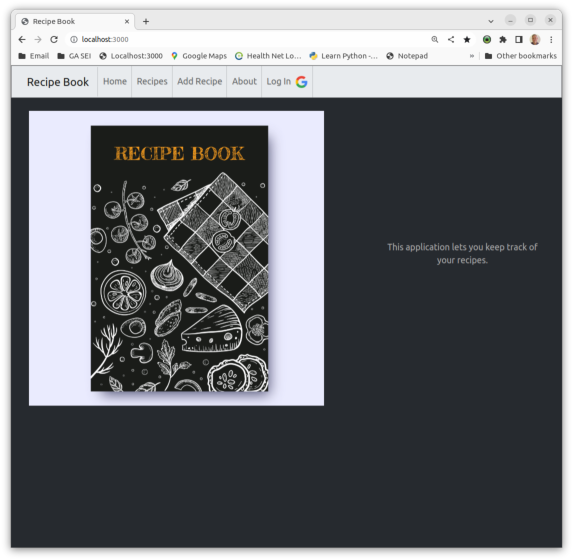
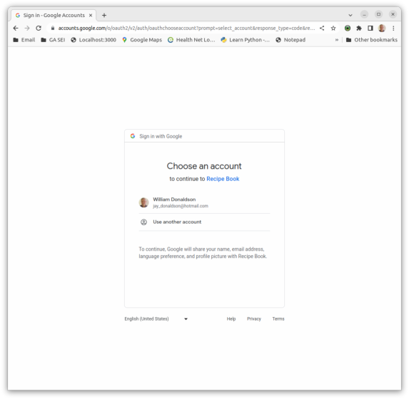
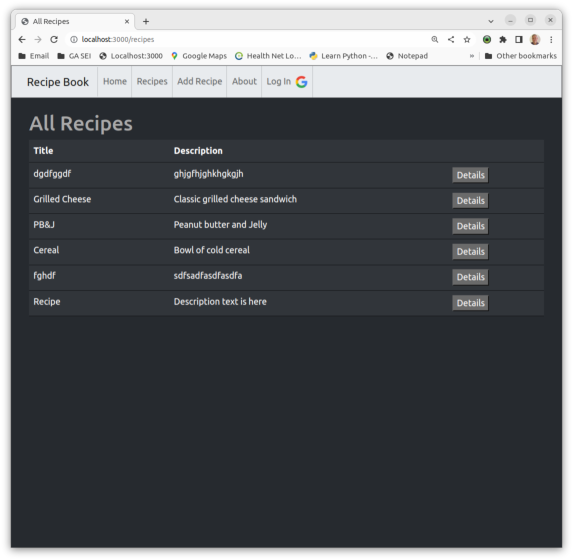
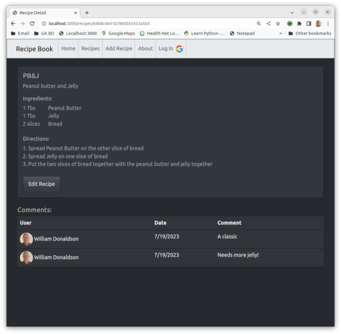
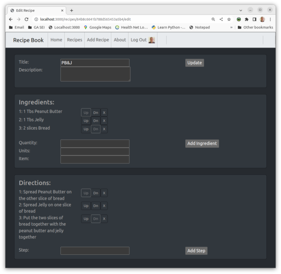
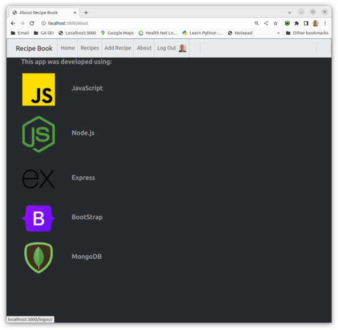

# Recipe Book

App for keeping track of recipes.  The user can view all the recipes in the system and view details on any recipe. If the user logs in, they can add commenmts to a recipe and add in their own recipes.

## Screenshots:

## Technologies Used:

* HTML5
* CSS3 - including flex grid
* Javascript
* Node.js
* Express
* Bootstrap
* MongoDB/Mongoose

## Getting Started:

Click [https://damp-caverns-98404-42a1560c1f01.herokuapp.com/](https://damp-caverns-98404-42a1560c1f01.herokuapp.com/) or [https://localhost:3000/](https://localhost:3000/) to load the application. Click Recipes to see a list of recipies. Log in with your Google account if you want to be able to comment on a recipe or add your own.

## Next Steps:
* Tie reciipes to the user that created them
* Allow users to add a pictures of recipes
* Allow users to specify recipes as favorites
* Allow users to filter recipes to only favorites
* Allow users to delete recipes
* Allow users to import recipes through an API
* Allow users to dispay nutrition information about ingredients/recipes

